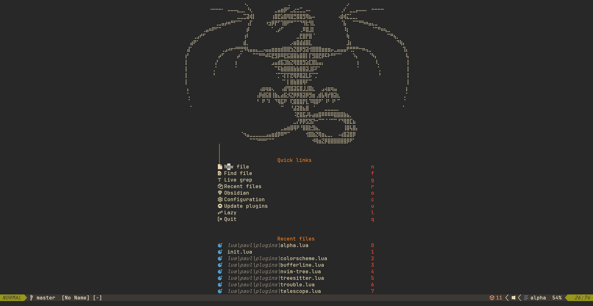
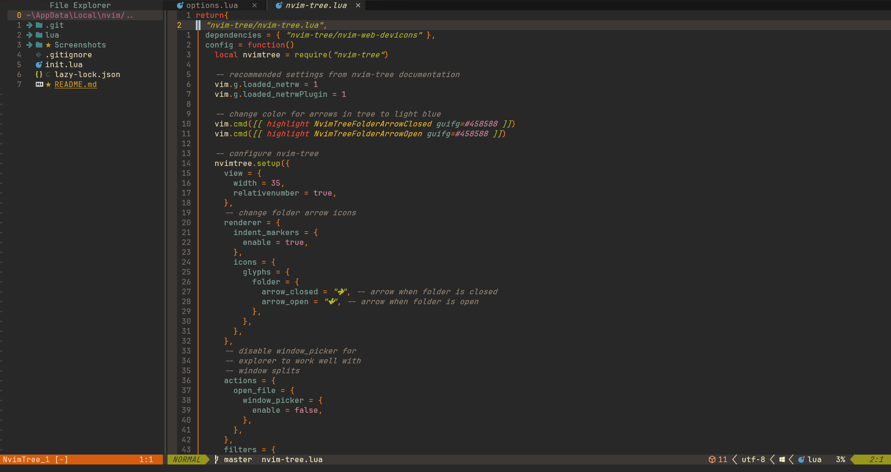

# Neovim configuration

- [Description](#description)
- [Plugins](#plugins)
- [Planned](#planned)

## Description
This is my personal neovim configuration. It is a work in progress and I am constantly tweaking it.
Some of the plugins are inspired by other people's configurations, some are my own.
I really love using neovim and and the vim-motions. I am trying to create the perfect configuration for me.
And I love that neovim gives me the ability to do that. Creating and tweaking my own PDE.
I hope you find this configuration useful.
My configuration is based around the colorscheme `gruvbox`. 
I am running neovim on Windows so my configuration is based on that but it should work on other platforms as well except for toggleterm which uses powershell.

Copied from [here](https://github.com/Magi3r/nvim/blob/1da6ca8ab79babf1d9e92c708b0137e16ab6be6f/lua/plugins/alpha-nvim.lua)

## Plugins
- Plugin manager: [lazy](https://github.com/folke/lazy.nvim)
- [alpha-nvim](https://github.com/goolord/alpha-nvim)
- [autopairs](https://github.com/windwp/nvim-autopairs)
- [cokeline](https://github.com/willothy/nvim-cokeline)
- [gruvbox](https://github.com/ellisonleao/gruvbox.nvim)
- [comment](https://github.com/numToStr/Comment.nvim)
- [copilot-chat](https://github.com/CopilotC-Nvim/CopilotChat.nvim)
- [copilot](https://github.com/github/copilot.vim)
- [dressing](https://github.com/stevearc/dressing.nvim)
- [lualine](https://github.com/nvim-lualine/lualine.nvim)
- [markdown-preview](https://github.com/iamcco/markdown-preview.nvim)
- [mini-indent](https://github.com/echasnovski/mini.indentscope)
- [nvim-cmp](https://github.com/hrsh7th/nvim-cmp)
- [nvim-tree](https://github.com/nvim-tree/nvim-tree.lua)
- [obsidian](https://github.com/nvim-tree/nvim-tree.lua)
- [telescope](https://github.com/nvim-telescope/telescope.nvim)
- [todo-comments](https://github.com/folke/todo-comments.nvim)
- [treesitter](https://github.com/nvim-telescope/telescope.nvim)
- [toggleterm](https://github.com/akinsho/toggleterm.nvim)
- [trouble](https://github.com/folke/trouble.nvim)
- [which-key](https://github.com/folke/which-key.nvim)
- [yanky](https://github.com/gbprod/yanky.nvim)
- [mason](https://github.com/williamboman/mason.nvim)
- [none-ls](https://github.com/nvimtools/none-ls.nvim)
- [lsp-config](https://github.com/neovim/nvim-lspconfig)
- [rust-tools](https://github.com/simrat39/rust-tools.nvim)

## Planned
- [ ] own colorscheme based on gruvbox(more red and pink less green)
- [ ] set up for debugging
- [ ] own alpha startup screen
